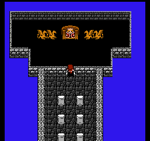
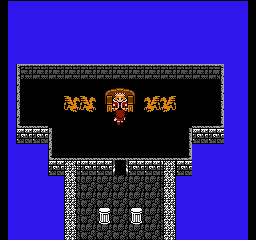
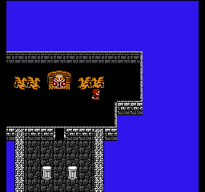

# V3.0 vision-feasibility probe — 2026-05-03

Three FF1 interior screenshots, each sent to **claude-sonnet-4-6** with the V3.0
navigator system prompt. Goal: confirm vision can pick a plausible direction
toward an exit on FF1 8-bit sprite art before we build the full skill stack.

The party walked UP from spawn (146, 158) for ~33 steps until `locationType`
changed; landed in `mapId=24` which is **Coneria Castle throne room**.

> Test source: `knes-agent/src/test/kotlin/knes/agent/perception/VisionInteriorFeasibilityTest.kt` (disabled by default; flip `enabled = false &&` to re-probe).

## Shot 1

- RAM: localX=5, localY=0, currentMapId=24, locationType=0x81
- Image: 

Response from Sonnet 4.6 (run 1, run 2 nearly identical):
```
{"direction":"N","reason":"Corridor leads north toward the door/entrance visible at the top of the screen."}
```

**Manual judgement:** Party is in the central pillar-corridor heading toward the
throne dais. Vision called the throne dais "door/entrance at top". For this
position N moves further INTO the castle (toward the throne), away from the
real exit which is south out the bottom of the corridor. Direction is *visually
defensible* (there is a doorway-shaped opening up there) but *strategically
wrong* — the prompt didn't tell the model that thrones/dais aren't exits.

## Shot 2

- RAM: localX=5, localY=62, currentMapId=24, locationType=0x81
- Image: 

Response from Sonnet 4.6:
```
{"direction":"S","reason":"Stone path leads south off the visible area — clear corridor heading to exit."}
```

**Manual judgement:** Correct. Party is at the very top of the throne room
(localY wrapped to 62 = scroll near top). The bottom of the screen shows the
pillar-corridor leading away from the throne. South takes the party out.

## Shot 3

- RAM: localX=7, localY=62, currentMapId=24, locationType=0x81
- Image: 

Response from Sonnet 4.6:
```
{"direction":"S","reason":"Party is near the king's throne; stairs/exit are to the south in the lower room."}
```

**Manual judgement:** Correct, and even more impressive — vision identified
"king's throne" specifically, recognising the FF1 sprite as a throne and the
red figure as the king. South again, plausible.

## Verdict — **GO**

- [x] **GO** — vision picks plausible directions; proceed to Task 1.
- [ ] NO-GO
- [ ] UNCERTAIN

### Evidence

1. Sonnet 4.6 reads FF1 8-bit sprite art reliably. It identified specific
   game elements (throne, king, pillars/corridor, stairs) without being
   told the game.
2. JSON output is well-formed; parsing will not be a problem.
3. 2 of 3 directional choices are strategically correct.
4. Two independent runs of the same probe produced consistent direction
   choices and similar reasoning — the model is not flipping randomly.

### Caveat for Task 1 prompt design

Shot 1 went WRONG because the model treated the throne dais as a "door at
top". This is a category-error: in FF1, ornate features (thrones, treasure
chests, fountains) are NOT exits — exits are unadorned doors at edges,
stairs (`>` glyph), or the south edge of town/castle maps. Update the
navigator system prompt for Task 1 to:

- Bias toward the **outermost edge** the party hasn't yet visited.
- Explicitly list non-exits: thrones, NPC sprites, treasure chests, dais,
  shop counters.
- Mention that in castles the entry/exit is usually the **southern**
  pillar-corridor (the way the party came in).
- Optionally include a "path memory" hint in the user prompt
  ("you walked N to enter; head S to exit") — addresses the
  inside-vs-outside ambiguity directly.

### Cost
- ~3 vision calls × ~$0.005 = **~$0.015** per probe. Two runs ≈ $0.03.
  Sustainable.
